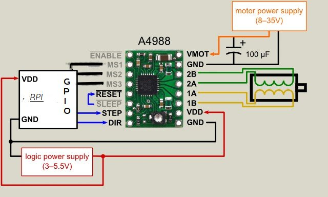

# RPi - Stepper Motor

> Prototype to move a stepper motor

+ Motor: Nema17
+ Driver: A4988

## HW Setup

## SW Setup

+ Create / activate virtual environment
+ `pip install -r requirements.txt`
+ `python app.py`

In order to start tkinter remotely on Raspberry Pi, set display environment variable first `export DISPLAY=:0.0`

## Documentation

+ [RpiMotorLib](https://github.com/gavinlyonsrepo/RpiMotorLib/blob/master/Documentation/Nema11A4988.md)
+ [tkinter](https://docs.python.org/3/library/tkinter.html)